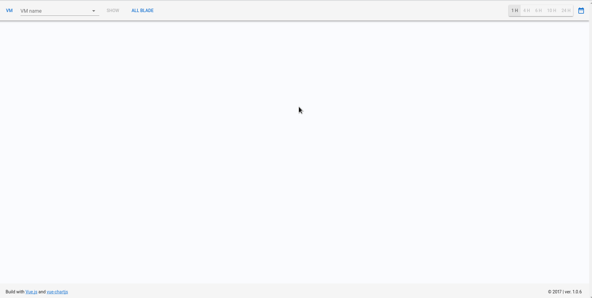

# Perf-stats

> Idea based on [npm-stats](https://github.com/apertureless/npm-stats)

using with [perfGetter](https://github.com/0x0BSoD/perfGetter)


#### VMWare ESXi Charts made with:

 - [Vue.js](https://github.com/vuejs/vue)
 - [Vuetify](https://github.com/vuetifyjs/vuetify)
 - [Vue.js wrapper for Chart.js](https://github.com/apertureless/vue-chartjs)


## Build Setup

``` bash
# install dependencies
npm install

# serve with hot reload at localhost:8080
npm run dev

# build for production with minification
npm run build

# build for production and view the bundle analyzer report
npm run build --report
```
